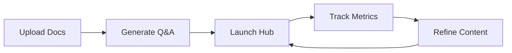

## Overview

BenefitsInteractive provides powerful tools to transform your benefits documents into an interactive hub. You centralize SPDs, FAQs, and policies, enabling employees to get instant answers while you track engagement and stay compliant. Key capabilities include building searchable Q&A, creating targeted campaign pages, and monitoring usage analytics.

<Callout kind="info">
Focus on these core features to reduce HR tickets by up to 50% and boost employee engagement.
</Callout>

## Key Features

Discover the main capabilities through these feature cards.

<Columns cols={3}>
  <Card title="Searchable Q&A" icon="search" href="#build-searchable-qa">
    Convert documents into natural-language search that answers employee questions instantly.
  </Card>
  <Card title="Enrollment Campaigns" icon="calendar" href="#create-campaign-pages">
    Build focused pages for open enrollment and policy updates.
  </Card>
  <Card title="Usage Tracking" icon="bar-chart-3" href="#track-usage">
    Monitor top questions, visits, and content performance.
  </Card>
</Columns>

## Build Searchable Q&A from Documents

Turn your plan documents, SPDs, and FAQs into a dynamic Q&A system.

<Steps>
  <Step title="Upload Materials" icon="upload">
    Connect your SPDs, carrier PDFs, FAQs, and videos to the dashboard.
  </Step>
  <Step title="Auto-Generate Q&A" icon="zap">
    BenefitsInteractive processes content into searchable topics and pathways.
  </Step>
  <Step title="Customize & Launch" icon="settings">
    Refine answers and deploy your interactive hub.
  </Step>
</Steps>

<CodeGroup tabs="Dashboard Config,API Upload">
  ```javascript
  // Example dashboard configuration
  const config = {
    sources: ['spd.pdf', 'faq.docx'],
    language: 'en',
    enableSearch: true
  };
  ```
  ```bash
  # API endpoint for uploading documents
  curl -X POST https://api.example.com/v1/documents \
    -H "Authorization: Bearer YOUR_API_KEY" \
    -F "file=@spd.pdf"
  ```
</CodeGroup>

## Create Enrollment Campaign Pages

Design launch-ready pages for specific events like open enrollment.

<Tabs>
  <Tab title="Open Enrollment" icon="calendar">
    Create a dedicated pathway guiding employees through plan choices.

    ```javascript
    // Campaign page structure
    const campaign = {
      name: "Open Enrollment 2024",
      sections: ["Health Plans", "Dental Options", "Enrollment Steps"],
      startDate: "2024-10-01"
    };
    ```

    <Callout kind="tip">
      Link campaigns to your Q&A hub for seamless navigation.
    </Callout>
  </Tab>
  <Tab title="Policy Updates" icon="edit-3">
    Update content for new policies and notify users automatically.

    <Expandable title="Advanced Customization" default-open="false">
      Add custom branding and compliance notices to pages.
    </Expandable>
  </Tab>
</Tabs>

## Track Usage and Top Questions

Gain insights into employee interactions to refine your content.

| Metric              | Description                          | Use Case                     |
|---------------------|--------------------------------------|------------------------------|
| Top Questions       | Most frequent searches and answers   | Identify knowledge gaps     |
| Page Visits         | Views per section or campaign        | Measure engagement          |
| Content Usage       | Popular documents and pathways       | Optimize for next cycle     |
| Drop-off Points     | Where users stop engaging            | Improve user experience     |



## Real-World Use Cases

<ExpandableGroup>
  <Expandable title="Open Enrollment Season" default-open="true">
    Reduce support tickets by 40% with self-service campaign pages and Q&A.
  </Expandable>
  <Expandable title="Ongoing Policy Changes">
    Quickly update the hub for new carrier info or compliance requirements.
  </Expandable>
  <Expandable title="Broker Client Onboarding">
    Share branded hubs to differentiate your services.
  </Expandable>
</ExpandableGroup>

<Callout kind="success" title="Next Steps">
Ready to get started? Visit the [Quickstart](/quickstart) guide to upload your first document.
</Callout>